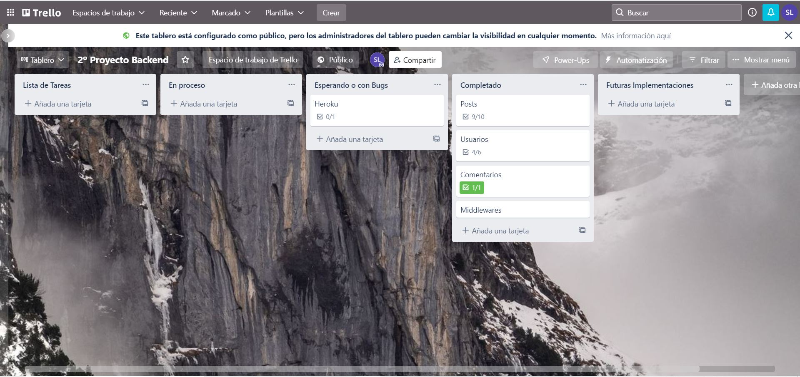
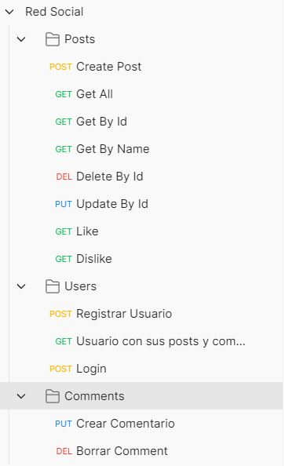

# Proyecto Backend

Creamos el backend de una red social haciendo uso de JS, NodeJS y MongoDB principalmente.

## HERRAMIENTAS 🛠️

- JavaScript
- NodeJS
- MongoDB
- Postman
- Heroku
- Trello

### Preview

Organización Trello:

Endpoints creados (Postman):

## Autor ✒️

- **Santiago Guevara** - _The Bridge_ - [santiremix](https://github.com/santiremix)
